# Visual Studio Codeの初期設定


## :one: Visual Studio Codeの画面構成

#### 画面構成
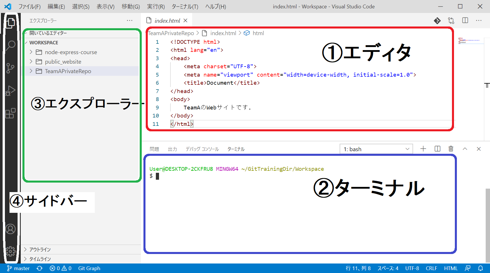

 1. エディタ・エリア：ファイルのコード編集を操作
 2. ターミナル・エリア：コマンド実行（Git等）を操作
 3. エクスプローラー・エリア：フォルダ・ファイルの操作
 4. サイドバー・エリア：拡張機能の追加の操作

## :two: Visual Studio Codeの初期設定

インストールしたVisual Studio Codeに以下の設定を行います。

| # | 項目                      | 内容           |
|---|---------------------------|----------------|
| 1 | 日本語化    　          | メニューの日本語化実行    |
| 2 | open in browser  | 指定のHTMLをブラウザで表示する  |
| 3 | ターミナル既定Shellの指定  | Bashを指定  |
| 4 | ワークスペースの設定     | 作業フォルダの指定 |

## :three: 日本語化

#### Visual Studio Code起動直後に日本語化設定
✔️ `インストールして再起動`をクリック<br>
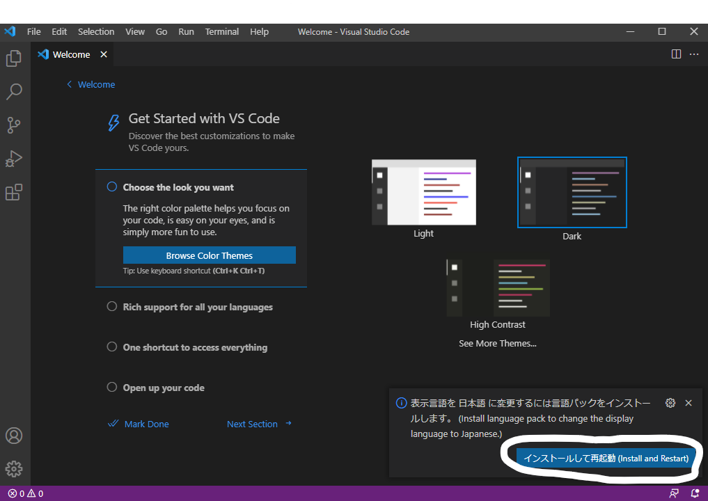
    
## :four: open in browser

Visual Studio Codeで作成したHTMLをブラウザで表示するためのプラグインをインストールします。

 1. ✔️ サイドバー「拡張機能」アイコンをクリック

 2. ✔️ 検索窓で「open in browser」 入力<br>
 3. ✔️ 「open in browser」 を選択<br>
 4. ✔️ 「Install」 をクリック<br>
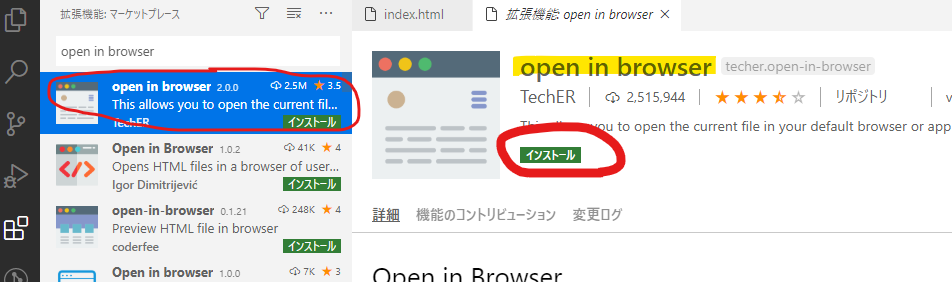


## :five: ターミナル既定Shellの指定

今回のトレーニングでは、Visual Studio Codeのターミナルで、Gitコマンド操作を実行します。<br>
トレーニング内でLinuxコマンドを使用しているため、ターミナルでBashを使用できるように設定します。

#### Bashの使用を設定操作
 1. ✔️ ターミナルメニュー「新しいターミナル」を選択<br>
（既定のShellが「PowerShell」になっている）<br>
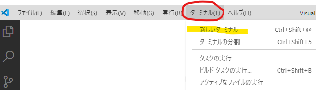
<hr>
 2. ✔️ ターミナルパネルのメニュー内のShell選択窓で「規定シェルの選択」をクリック<br>
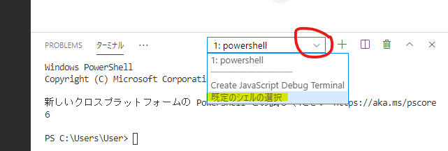
<hr>
 3. ✔️ 「Git Bash 」選択
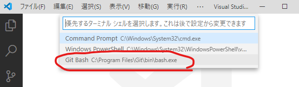
<hr>
 4. ✔️ 現在のターミナルを強制中止
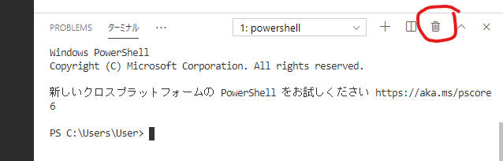
<hr>
 5. ✔️ 再び、ターミナルメニュー「新しいターミナル」を選択<br>

<hr>
 6. ✔️ ターミナルのShellが「Bash」に変更されていることを確認<br>
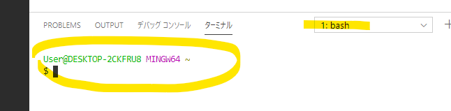

##  :six: 作業フォルダ（ワークスペース）の指定

今回のトレーニングでは、Windowsユーザフォルダ下に「<u>git_training_dir</u>」を用意し<br>
Visual Studio Codeの作業フォルダ（ワークスペース）として指定します。

| # | 項目                      | Visual Studio Code作業環境           |
|---|---------------------------|----------------|
| 1 | 作業フォルダ新規作成    | ターミナル |
| 2 | 作業フォルダを開く    | ファイルメニュー操作 |
| 3 | ワークスペースの設定  | ファイルメニュー操作  |

### （１）作業フォルダ新規作成

 1. ✔️ ターミナルでWindowsユーザフォルダー下に作業フォルダを作成するコマンドを実行<br>
```bash
mkdir $USERPROFILE/git_training_dir
```
> $USERPROFILEは、Windowsユーザ・フォルダーのパス環境変数です。

### （２）ワークスペースの設定

 1. ✔️ ファイルメニュー「フォルダーを開く」を選択<br>
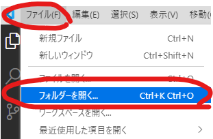
<hr>
 2. ✔️ Windowsユーザフォルダ下の「<u>git_training_dir</u>」を選択し「フォルダーの選択」クリック<br>
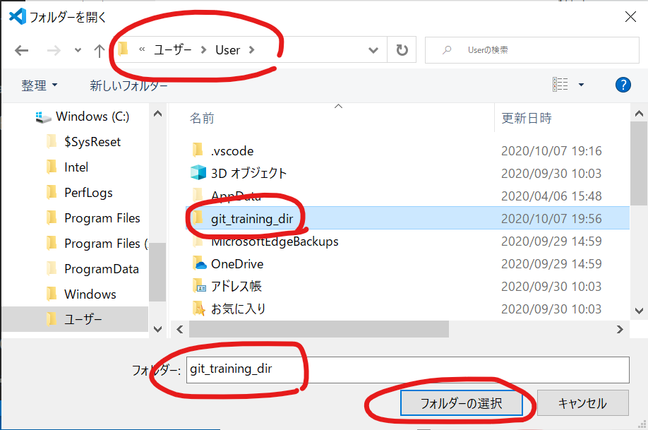

* 下記画面が表示された場合は、"親フォルダー～"のチェックをONにした上で、"はい、作成者を信頼します"ボタンをクリック
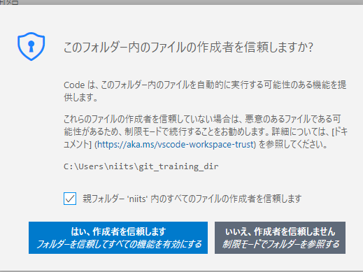

<hr>
 3. ✔️ エクスプローラーで「git_training_dir」が開かれている状態になっていることを確認
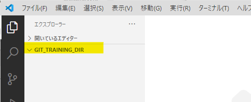
<hr>
 4. ✔️ ファイルメニュー「名前を付けてワークスペースを保存」をクリック<br>
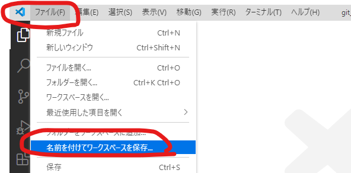
<hr>
 5. ✔️ デスクトップ下を選択し、ファイル名に「Git入門トレーニング」と入力し「保存」クリック<br>
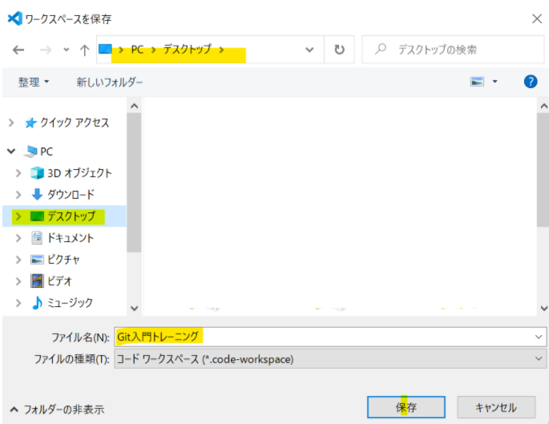
<hr>
 6. ✔️ 開かれているフォルダーがワークスペースとして表示されていることを確認<br>
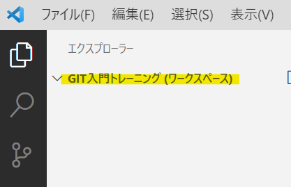
<hr>
 7. ✔️ デスクトップにワークスペース・ファイルが存在することを確認<br>
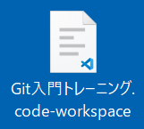
